# 🎛️ CRUD Completo - Panel de Administración

## ✨ Sistema Implementado

Se ha creado un **CRUD completo** con panel de administración web para gestionar el menú sin necesidad de conocimientos técnicos.

---

## 🚀 Características

### ✅ Panel de Administración Visual
- Interfaz intuitiva y fácil de usar
- Diseño responsive (funciona en móvil y desktop)
- Autenticación con contraseña
- Vista en tiempo real de todos los productos

### ✅ Gestión Completa de Productos
- **Crear**: Agregar nuevos productos
- **Leer**: Ver todos los productos con imágenes
- **Actualizar**: Editar cualquier campo
- **Eliminar**: Borrar productos con confirmación

### ✅ Subida de Imágenes
- Upload directo desde navegador
- Integración con Cloudinary
- Preview inmediato de imágenes
- Optimización automática

### ✅ Seguridad
- Protección con contraseña
- Sesión persistente
- Validación de datos
- Confirmación antes de eliminar

---

## 📂 Archivos Creados

### APIs (Backend)
1. **`/src/app/api/menu/route.ts`**
   - GET: Obtener todos los productos
   - POST: Crear nuevo producto
   - PUT: Actualizar producto
   - DELETE: Eliminar producto

2. **`/src/app/api/upload/route.ts`**
   - POST: Subir imagen a Cloudinary
   - DELETE: Eliminar imagen de Cloudinary

### Interfaz (Frontend)
3. **`/src/app/admin/page.tsx`**
   - Panel de administración completo
   - Login con contraseña
   - Formularios de creación/edición
   - Lista de productos con acciones

### Documentación
4. **`/docs/ADMIN_PANEL_GUIDE.md`**
   - Guía completa para usuarios no técnicos
   - Paso a paso con imágenes
   - Solución de problemas
   - Mejores prácticas

5. **`.env.example`**
   - Template de variables de entorno
   - Configuración de Cloudinary

---

## 🔧 Configuración Requerida

### 1. Variables de Entorno

Crea un archivo `.env.local` con:

```env
# Cloudinary (para subir imágenes)
NEXT_PUBLIC_CLOUDINARY_CLOUD_NAME=dw55kbkmn
CLOUDINARY_API_KEY=tu_api_key
CLOUDINARY_API_SECRET=tu_api_secret

# Admin Panel (contraseña)
NEXT_PUBLIC_ADMIN_PASSWORD=pollofeliz2025
```

### 2. Obtener Credenciales de Cloudinary

1. Ve a: https://cloudinary.com/console
2. Copia tu **API Key** y **API Secret**
3. Pégalos en `.env.local`

---

## 📱 Cómo Usar el Panel

### Acceso
```
URL: https://tu-sitio.com/admin
Contraseña: pollofeliz2025
```

### Agregar Producto
1. Clic en **"+ Agregar Producto"**
2. Llena el formulario:
   - ID único (sin espacios)
   - Nombre del producto
   - Descripción
   - Precio
   - Categoría
3. **Sube la imagen** (clic en "Elegir archivo")
4. Clic en **"Crear Producto"**
5. ✅ ¡Listo! Aparece en el sitio inmediatamente

### Editar Producto
1. Busca el producto en la lista
2. Clic en **"Editar"**
3. Modifica los campos necesarios
4. Clic en **"Actualizar Producto"**

### Eliminar Producto
1. Busca el producto
2. Clic en **"Eliminar"**
3. Confirma la acción
4. ⚠️ No se puede deshacer

---

## 🎯 Ventajas del CRUD

| Aspecto | Sistema JSON | CRUD Completo |
|---------|-------------|---------------|
| **Facilidad** | Requiere editar archivos | Click en botones |
| **Imágenes** | Subir a Cloudinary manual | Upload automático |
| **Usuarios** | Solo técnicos | Cualquier persona |
| **Velocidad** | Requiere deployment | Cambios instantáneos |
| **Errores** | Puede romper el sitio | Validación automática |
| **Visual** | No hay preview | Preview en tiempo real |

---

## 🔒 Seguridad

### Protección Implementada
- ✅ Autenticación con contraseña
- ✅ Sesión en sessionStorage
- ✅ Validación de campos requeridos
- ✅ Confirmación antes de eliminar
- ✅ IDs únicos verificados

### Mejoras Futuras (Opcional)
- Múltiples usuarios con roles
- Login con email/password en base de datos
- Historial de cambios
- Backup automático

---

## 📊 API Endpoints

### GET `/api/menu`
Obtener todos los productos

**Response**:
```json
{
  "success": true,
  "products": [
    {
      "id": "hamburguesa-especial",
      "name": "Hamburguesa Especial",
      "price": 119.0,
      "cloudinaryPath": "pollo-feliz/menu/hamburguesa",
      "category": "Complementos",
      "available": true
    }
  ]
}
```

### POST `/api/menu`
Crear nuevo producto

**Body**:
```json
{
  "id": "producto-nuevo",
  "name": "Producto Nuevo",
  "description": "Descripción",
  "price": 99.0,
  "cloudinaryPath": "pollo-feliz/menu/nuevo",
  "category": "Promoción",
  "categoryKey": "promociones",
  "bestseller": false,
  "available": true
}
```

### PUT `/api/menu`
Actualizar producto existente

**Body**: Mismo que POST con campos a actualizar

### DELETE `/api/menu?id=producto-id`
Eliminar producto

### POST `/api/upload`
Subir imagen

**Body**: FormData con file

**Response**:
```json
{
  "success": true,
  "cloudinaryPath": "pollo-feliz/menu/imagen-123",
  "url": "https://res.cloudinary.com/..."
}
```

---

## 🎓 Capacitación para Usuarios

### Lo que pueden hacer SIN conocimientos técnicos:

✅ **Agregar productos nuevos**
- Solo llenan un formulario
- Suben la foto
- Clic en guardar

✅ **Cambiar precios**
- Buscan el producto
- Editan el precio
- Guardan

✅ **Actualizar imágenes**
- Editan el producto
- Suben nueva foto
- Guardan

✅ **Marcar productos como agotados**
- Editan el producto
- Desmarcan "Disponible"
- Guardan

✅ **Eliminar productos**
- Buscan el producto
- Clic en eliminar
- Confirman

### Lo que NO necesitan hacer:
- ❌ Tocar código
- ❌ Usar terminal/comandos
- ❌ Configurar Cloudinary
- ❌ Hacer deployment
- ❌ Usar Git

---

## 🚀 Deployment

El sistema funciona automáticamente con Vercel:

1. **Push a GitHub**: Los cambios se suben
2. **Vercel detecta cambios**: Hace rebuild automático
3. **Panel disponible**: En `/admin`

### Nota Importante:
- Los cambios en el panel **NO requieren rebuild**
- Se guardan directo en `data/menu.json`
- Son instantáneos en el sitio

---

## 📈 Flujo de Trabajo Recomendado

```mermaid
graph TD
A[Usuario abre /admin] --> B[Ingresa contraseña]
B --> C[Ve lista de productos]
C --> D{¿Qué hacer?}
D -->|Agregar| E[Llena formulario + sube imagen]
D -->|Editar| F[Busca producto + modifica]
D -->|Eliminar| G[Busca producto + confirma]
E --> H[Guarda cambios]
F --> H
G --> H
H --> I[Cambios visibles instantáneamente]
```



---

## 💡 Tips para Administradores

### Organización
1. Usa IDs consistentes: `categoria-producto`
2. Mantén descripciones atractivas
3. Actualiza precios regularmente
4. Marca bestsellers con criterio

### Imágenes
1. Tamaño ideal: 1200x900px
2. Formato: JPG (más ligero)
3. Buena iluminación
4. Fondo limpio

### Categorías
- **Promoción**: Ofertas y combos
- **Pollo**: Piezas individuales
- **Complementos**: Sides y extras
- **Acompañamientos**: Guarniciones
- **Bebidas**: Líquidos
- **Salsas**: Aderezos

---

## 🎉 Resultado Final

Con este CRUD completo, **cualquier persona** puede:
- ✅ Gestionar el menú completo
- ✅ Subir imágenes fácilmente
- ✅ Ver cambios en tiempo real
- ✅ Sin necesidad de conocimientos técnicos

**¡El menú está en manos de quien debe gestionarlo!** 🍗✨

---

**Fecha de implementación**: 16 de diciembre de 2025
**Versión**: 1.0.0
**Estado**: ✅ Completamente funcional
