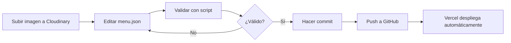

# 📋 Guía de Gestión del Menú - Pollo Feliz

## 🎯 Descripción General

Este sistema te permite gestionar las imágenes y productos del menú de forma **fácil y organizada** usando archivos JSON. No necesitas tocar código TypeScript para actualizar el menú.

---

## 📁 Estructura del Sistema

```
data/
  ├── menu.json              # ⭐ Archivo principal del menú
  ├── menu-schema.json       # Esquema de validación
  └── menu-report.json       # Reporte generado automáticamente

scripts/
  └── validate-menu.js       # Script para validar y sincronizar

src/
  ├── app/data/platos.ts     # Archivo TypeScript (respaldo)
  └── lib/cloudinary-images.ts  # Configuración de Cloudinary
```

---

## 🚀 Cómo Agregar o Modificar Productos

### Opción 1: Editar `data/menu.json` (RECOMENDADO)

1. **Abre el archivo**: `data/menu.json`

2. **Encuentra la categoría**: Elige dónde agregar tu producto
   - `promociones` - Ofertas especiales
   - `pollo` - Piezas de pollo
   - `complementos` - Nuggets, hamburguesas
   - `acompañamientos` - Papas, ensaladas
   - `bebidas` - Refrescos, agua
   - `salsas` - Salsas y aderezos

3. **Copia y modifica** este template:

```json
{
  "id": "producto-nuevo",
  "name": "Nombre del Producto",
  "description": "Descripción atractiva del producto.",
  "price": 99.0,
  "cloudinaryPath": "pollo-feliz/carpeta/nombre-imagen",
  "category": "Categoría",
  "bestseller": false,
  "available": true
}
```

4. **Guarda el archivo** y ejecuta la validación:

```bash
node scripts/validate-menu.js --sync
```

---

## 🖼️ Cómo Gestionar Imágenes

### Paso 1: Subir Imagen a Cloudinary

1. **Ve a tu panel de Cloudinary**: https://cloudinary.com/console
2. **Sube la imagen** a la carpeta `pollo-feliz/`
   - Ejemplo: `pollo-feliz/platillos/nuevo-producto.jpg`
3. **Copia el path** (sin la extensión):
   - `pollo-feliz/platillos/nuevo-producto`

### Paso 2: Actualizar el JSON

En `data/menu.json`, usa el path en `cloudinaryPath`:

```json
{
  "id": "nuevo-producto",
  "name": "Nuevo Producto",
  "cloudinaryPath": "pollo-feliz/platillos/nuevo-producto",
  ...
}
```

### Paso 3: Validar

```bash
node scripts/validate-menu.js --check
```

---

## 🔧 Scripts Disponibles

### Validar el menú
Verifica que la estructura del JSON sea correcta:

```bash
node scripts/validate-menu.js
```

### Validar con verificación completa
Verifica estructura y busca problemas:

```bash
node scripts/validate-menu.js --check
```

### Sincronizar y generar reporte
Valida, sincroniza y genera un reporte completo:

```bash
node scripts/validate-menu.js --sync
```

### Solo generar reporte
Crea un reporte de estadísticas:

```bash
node scripts/validate-menu.js --report
```

---

## 📊 Ejemplo Completo

### Agregar una nueva hamburguesa:

1. **Sube la imagen** a Cloudinary:
   - Carpeta: `pollo-feliz/hamburguesas/`
   - Nombre: `hamburguesa-especial.jpg`

2. **Edita `data/menu.json`**, sección `complementos`:

```json
{
  "id": "hamburguesa-especial",
  "name": "Hamburguesa Especial",
  "description": "Hamburguesa premium con ingredientes selectos.",
  "price": 119.0,
  "cloudinaryPath": "pollo-feliz/hamburguesas/hamburguesa-especial",
  "category": "Complementos",
  "bestseller": true,
  "available": true
}
```

3. **Valida**:

```bash
node scripts/validate-menu.js --sync
```

4. **Verifica en el sitio**:
   - Ve a `/menu`
   - Busca tu nuevo producto

---

## ✅ Checklist para Agregar Productos

- [ ] Imagen subida a Cloudinary en carpeta correcta
- [ ] Path de Cloudinary copiado (sin extensión)
- [ ] ID único asignado al producto
- [ ] Nombre y descripción atractivos
- [ ] Precio correcto
- [ ] Categoría apropiada
- [ ] `available: true` si está disponible
- [ ] JSON validado con `node scripts/validate-menu.js`
- [ ] Producto visible en `/menu`

---

## 🎨 Organización de Carpetas en Cloudinary

Mantén esta estructura para mejor organización:

```
pollo-feliz/
├── menu/              # Imágenes de promociones del menú
├── platillos/         # Piezas de pollo (cadera, pierna, etc.)
├── hamburguesas/      # Hamburguesas
├── nuggets/           # Nuggets y derivados
├── ensaladas/         # Ensaladas
├── bebidas/           # Bebidas y refrescos
├── salsas/            # Salsas y aderezos
└── slider/            # Imágenes para el slider del home
```

---

## 🐛 Solución de Problemas

### Error: "ID duplicado"
**Problema**: Dos productos tienen el mismo `id`
**Solución**: Cambia uno de los IDs para que sean únicos

### Error: "Sin imagen"
**Problema**: `cloudinaryPath` está vacío o incorrecto
**Solución**: Verifica que la imagen exista en Cloudinary y el path sea correcto

### Error: "JSON inválido"
**Problema**: Sintaxis incorrecta en el JSON
**Solución**: Usa un validador JSON online: https://jsonlint.com/

### Imagen no se muestra
**Problema**: Path de Cloudinary incorrecto
**Solución**: 
1. Ve a Cloudinary
2. Haz clic en la imagen
3. Copia el "Public ID" sin la extensión
4. Actualiza `cloudinaryPath` en el JSON

---

## 💡 Tips y Mejores Prácticas

1. **IDs descriptivos**: Usa nombres claros como `hamburguesa-premium` en vez de `prod-001`

2. **Descripciones atractivas**: Escribe descripciones que vendan el producto
   - ❌ "Hamburguesa de pollo"
   - ✅ "Hamburguesa jugosa con pollo empanizado crujiente y papas doradas"

3. **Precios consistentes**: Usa siempre 2 decimales (`99.00` no `99`)

4. **Valida siempre**: Ejecuta `node scripts/validate-menu.js` antes de hacer commit

5. **Imágenes optimizadas**: Sube imágenes de buena calidad pero no excesivamente pesadas
   - Recomendado: 1200x900px, JPG, calidad 80-90%

6. **Bestsellers**: Marca como `bestseller: true` solo tus productos más vendidos

7. **Disponibilidad**: Usa `available: false` para productos temporalmente agotados

---

## 📝 Campos del JSON Explicados

| Campo | Tipo | Requerido | Descripción |
|-------|------|-----------|-------------|
| `id` | string | ✅ Sí | Identificador único del producto |
| `name` | string | ✅ Sí | Nombre del producto |
| `description` | string | ❌ No | Descripción atractiva |
| `price` | number | ❌ No | Precio en MXN |
| `cloudinaryPath` | string | ✅ Sí | Path en Cloudinary (sin extensión) |
| `category` | string | ✅ Sí | Categoría del producto |
| `bestseller` | boolean | ❌ No | Si es más vendido |
| `available` | boolean | ✅ Sí | Si está disponible |

---

## 🔄 Flujo de Trabajo Recomendado



---

## 📞 Soporte

Si tienes dudas sobre la gestión del menú:

1. Revisa esta guía completa
2. Ejecuta `node scripts/validate-menu.js` para ver errores específicos
3. Verifica la consola del navegador en `/menu`

---

## 🎉 ¡Listo!

Ahora puedes gestionar el menú fácilmente sin tocar código TypeScript. Solo edita el JSON, valida y listo.

**Recuerda**: Siempre valida con `node scripts/validate-menu.js --sync` antes de subir cambios.
